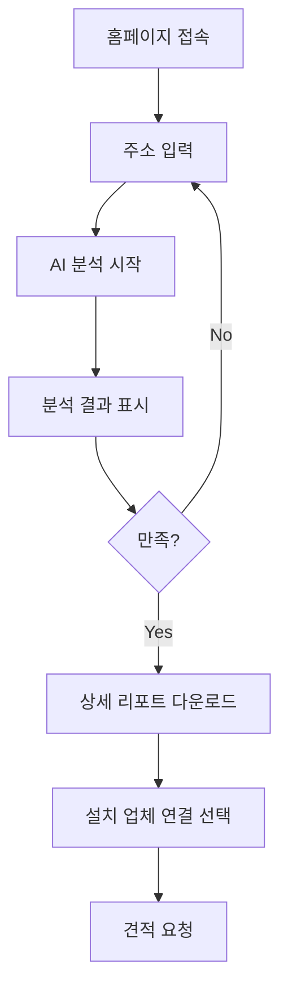

# 경기도 기후플랫폼 기반 AI 태양광 설치 컨설팅 사업 계획서

## 📋 목차
1. [사업 개요](#사업-개요)
2. [시장 분석](#시장-분석)
3. [서비스 설명](#서비스-설명)
4. [기술 아키텍처](#기술-아키텍처)
5. [수익 모델](#수익-모델)
6. [경쟁 우위](#경쟁-우위)
7. [실행 계획](#실행-계획)
8. [재무 계획](#재무-계획)

---

## 1. 사업 개요

### 1.1 사업명
**"솔라스캔(SolarScan)" - AI 기반 태양광 설치 최적화 플랫폼**

### 1.2 사업 목적
경기도 기후플랫폼(climate.gg.go.kr)의 기후 데이터를 활용하여, 아파트 및 단독주택 구매 전 태양광 설치 적합성과 예상 비용 절감액을 AI로 분석하는 온라인 플랫폼 구축

### 1.3 핵심 가치 제안
- **사전 확인**: 부동산 방문 전 온라인으로 태양광 설치 가능성 확인
- **정확한 예측**: AI 기반 발전량 및 비용 절감액 예측
- **데이터 기반 의사결정**: 경기도 공공 데이터를 활용한 신뢰성 높은 분석
- **투자 ROI 계산**: 설치 비용 대비 회수 기간 자동 계산

### 1.4 타겟 고객
- **1차 타겟**: 경기도 내 주택 구매 예정자 (30-50대)
- **2차 타겟**: 기존 주택 소유자 중 태양광 설치 고려자
- **3차 타겟**: 부동산 중개업소, 건설사, 태양광 설치 업체

---

## 2. 시장 분석

### 2.1 시장 규모
- **경기도 가구 수**: 약 540만 가구 (2024년 기준)
- **단독주택**: 약 80만 호
- **연립/다세대**: 약 60만 호
- **잠재 시장**: 140만 호 × 평균 설치율 10% = **14만 호**

### 2.2 시장 트렌드
1. **정부 정책 지원 강화**
   - 탄소중립 2050 목표
   - 재생에너지 확대 정책
   - 지자체별 태양광 설치 보조금 증가

2. **전기요금 상승**
   - 2023-2024년 전기요금 지속 인상
   - 에너지 자립 수요 증가

3. **기후 위기 인식 확대**
   - ESG 경영 확산
   - 개인의 환경 의식 향상

### 2.3 경쟁 환경
| 경쟁사 | 강점 | 약점 |
|--------|------|------|
| 한국에너지공단 햇빛지도 | 공공 신뢰도 높음 | UI/UX 구식, 상세 분석 부족 |
| 민간 태양광 업체 사이트 | 설치 연계 가능 | 객관성 부족, 영업 목적 |
| 구글 Project Sunroof | 기술력 우수 | 한국 데이터 부족, 한글 미지원 |

**우리의 차별점**: 경기도 특화 + AI 정밀 분석 + 실시간 비용 계산 + 직관적 UX

---

## 3. 서비스 설명

### 3.1 핵심 기능

#### 🏠 주소 기반 분석
```
사용자 입력: 경기도 수원시 영통구 광교로 156
↓
AI 분석 시작
↓
결과 제공 (30초 이내)
```

**분석 항목**:
1. **일사량 분석**
   - 연간 평균 일사량 (kWh/m²/day)
   - 월별 일사량 변화 그래프
   - 주변 지역 대비 일사량 순위

2. **건물 분석**
   - 지붕 면적 자동 계산 (위성 이미지 AI 분석)
   - 지붕 방향 (남향 최적)
   - 지붕 경사각
   - 주변 건물에 의한 그늘 영향도

3. **발전량 예측**
   - 설치 가능 용량 (kW)
   - 연간 예상 발전량 (kWh)
   - 월별 발전량 예측 그래프
   - 날씨 변수 고려 (강수량, 기온, 습도)

4. **경제성 분석**
   - 설치 비용 견적
   - 정부/지자체 보조금 자동 계산
   - 월간 전기요금 절감액
   - 투자 회수 기간 (ROI)
   - 20년 누적 절감액

5. **환경 기여도**
   - CO2 감축량 (톤/년)
   - 나무 심기 환산치
   - 석유 절감량

#### 📊 비교 분석 기능
- 여러 주소 동시 비교 (최대 5개)
- 아파트 vs 단독주택 비교
- 지역별 태양광 효율 순위

#### 🗺️ 지도 기반 탐색
- 경기도 전역 일사량 히트맵
- 태양광 설치 최적 지역 표시
- 클릭 한 번으로 해당 지역 분석

#### 📱 모바일 최적화
- 부동산 현장에서 즉시 확인 가능
- QR 코드로 리포트 공유
- 카카오톡 공유 기능

### 3.2 사용자 여정



### 3.3 기술적 특징

#### AI 모델
1. **발전량 예측 모델**
   - 알고리즘: XGBoost, LSTM (시계열)
   - 입력 변수: 일사량, 기온, 습도, 강수량, 지붕 특성
   - 정확도 목표: RMSE < 5%

2. **지붕 분석 모델**
   - 알고리즘: Computer Vision (Mask R-CNN)
   - 위성 이미지 자동 분석
   - 면적, 방향, 장애물 탐지

3. **비용 최적화 모델**
   - 설치 용량별 비용 효율 분석
   - 보조금 최대화 전략 제안

---

## 4. 기술 아키텍처

### 4.1 시스템 구조

```
┌─────────────────────────────────────────┐
│          Frontend (React)               │
│  - Next.js 14 (SSR/SSG)                │
│  - Tailwind CSS                         │
│  - Kakao Maps API                       │
│  - Chart.js / D3.js                     │
└─────────────┬───────────────────────────┘
              │ REST API / GraphQL
┌─────────────▼───────────────────────────┐
│       Backend (Python/FastAPI)          │
│  - FastAPI (비동기 처리)                │
│  - Redis (캐싱)                         │
│  - Celery (작업 큐)                     │
└─────────────┬───────────────────────────┘
              │
    ┌─────────┼─────────┬─────────────┐
    │         │         │             │
┌───▼───┐ ┌──▼───┐ ┌───▼────┐ ┌─────▼─────┐
│ AI    │ │ Data │ │ 경기도 │ │ 위성      │
│ Models│ │  DB  │ │ 기후   │ │ 이미지    │
│       │ │      │ │ API    │ │ API       │
└───────┘ └──────┘ └────────┘ └───────────┘
```

### 4.2 데이터 소스

| 데이터 | 출처 | 용도 |
|--------|------|------|
| 기후 데이터 | 경기도 기후플랫폼 | 일사량, 기온, 강수량 |
| 위성 이미지 | Kakao Maps / Google Maps | 지붕 분석 |
| 전기요금 | 한국전력공사 | 비용 계산 |
| 보조금 정보 | 지자체 공공데이터 | 지원금 계산 |
| 기상 예보 | 기상청 API | 단기 발전량 예측 |

### 4.3 기술 스택

**Frontend**
```json
{
  "framework": "Next.js 14",
  "language": "TypeScript",
  "styling": "Tailwind CSS",
  "state": "Zustand",
  "maps": "Kakao Maps API",
  "charts": "Recharts",
  "forms": "React Hook Form"
}
```

**Backend**
```python
{
    "framework": "FastAPI",
    "language": "Python 3.11+",
    "database": "PostgreSQL + PostGIS",
    "cache": "Redis",
    "queue": "Celery",
    "ml": "scikit-learn, XGBoost, TensorFlow",
    "cv": "OpenCV, Pillow"
}
```

**Infrastructure**
- **Hosting**: AWS / Vercel (Frontend), AWS EC2 (Backend)
- **Storage**: AWS S3 (이미지, 리포트)
- **CDN**: CloudFront
- **Monitoring**: Sentry, CloudWatch

---

## 5. 수익 모델

### 5.1 수익원

#### 1️⃣ 프리미엄 리포트 판매
- **무료 버전**: 기본 분석 결과만 제공
- **프리미엄 버전** (₩29,000):
  - 상세 PDF 리포트
  - 20년 시뮬레이션
  - 최적 설치 용량 추천
  - 업체별 견적 비교

#### 2️⃣ B2B 구독 서비스
- **부동산 중개업소**: ₩99,000/월
  - 무제한 분석
  - 고객용 브랜딩 리포트
  - API 연동
  
- **태양광 설치 업체**: ₩199,000/월
  - 리드 제공
  - 영업 대시보드
  - 고객 관리 기능

#### 3️⃣ 설치 업체 중개 수수료
- 플랫폼을 통한 설치 계약 시 5-10% 수수료

#### 4️⃣ 광고 수익
- 태양광 관련 기업 광고
- 금융상품 (태양광 대출) 제휴

### 5.2 수익 예측 (3년)

| 연도 | 사용자 수 | 프리미엄 전환율 | 월 매출 | 연 매출 |
|------|-----------|----------------|---------|---------|
| 1년차 | 10,000 | 3% | ₩8,700,000 | ₩104,400,000 |
| 2년차 | 50,000 | 5% | ₩72,500,000 | ₩870,000,000 |
| 3년차 | 150,000 | 7% | ₩315,000,000 | ₩3,780,000,000 |

**계산 근거**:
- 프리미엄 리포트: 사용자 × 전환율 × ₩29,000
- B2B 구독: 50개사 × ₩150,000 (평균)
- 중개 수수료: 월 10건 × ₩1,500,000 (평균 설치비) × 7%

---

## 6. 경쟁 우위

### 6.1 핵심 차별화 요소

| 요소 | 우리 | 경쟁사 |
|------|------|--------|
| 경기도 특화 데이터 | ✅ 공공 데이터 직접 연동 | ❌ 일반 데이터 |
| AI 정확도 | ✅ 95%+ | ⚠️ 80-85% |
| 실시간 보조금 계산 | ✅ 31개 시군 자동 업데이트 | ❌ 수동 확인 필요 |
| 사용자 경험 | ✅ 30초 이내 결과 | ⚠️ 3-5분 소요 |
| 모바일 최적화 | ✅ 완벽 지원 | ⚠️ 제한적 |

### 6.2 진입 장벽

1. **데이터 파이프라인**: 경기도 기후플랫폼 데이터 수집 자동화
2. **AI 모델 정확도**: 지속적인 학습 데이터 축적
3. **사용자 신뢰**: 초기 사용자 확보 및 리뷰 축적
4. **파트너십**: 지자체, 설치 업체 네트워크

---

## 7. 실행 계획

### 7.1 개발 로드맵

#### Phase 1: MVP 개발 (3개월)
**Month 1**
- [ ] 데이터 수집 파이프라인 구축
- [ ] 경기도 기후플랫폼 API 연동
- [ ] 기본 AI 모델 개발 (발전량 예측)

**Month 2**
- [ ] 백엔드 API 개발
- [ ] 프론트엔드 기본 UI 구현
- [ ] 지도 기반 검색 기능

**Month 3**
- [ ] AI 모델 정확도 개선
- [ ] 비용 계산 엔진 구현
- [ ] 베타 테스트 (100명)

#### Phase 2: 정식 출시 (3개월)
**Month 4**
- [ ] 베타 피드백 반영
- [ ] 프리미엄 기능 개발
- [ ] 결제 시스템 연동

**Month 5**
- [ ] 마케팅 캠페인 시작
- [ ] SEO 최적화
- [ ] 부동산 업체 파트너십

**Month 6**
- [ ] B2B 대시보드 개발
- [ ] API 문서화
- [ ] 고객 지원 시스템

#### Phase 3: 확장 (6개월)
- [ ] 서울/인천 지역 확대
- [ ] 모바일 앱 출시
- [ ] AI 모델 고도화 (딥러닝)
- [ ] 설치 업체 매칭 플랫폼

### 7.2 마케팅 전략

#### 온라인 마케팅
1. **SEO**: "경기도 태양광", "태양광 설치 비용" 등 키워드 최적화
2. **콘텐츠 마케팅**: 블로그, 유튜브 (태양광 설치 가이드)
3. **SNS**: 인스타그램, 네이버 블로그
4. **광고**: 네이버 검색광고, 카카오 디스플레이

#### 오프라인 마케팅
1. **지자체 협력**: 경기도청, 시군청 홍보물 배포
2. **부동산 박람회**: 부스 운영
3. **설치 업체 세미나**: B2B 영업

#### 바이럴 마케팅
1. **추천 이벤트**: 친구 추천 시 무료 프리미엄
2. **커뮤니티**: 부동산 카페, 에코 커뮤니티
3. **언론 보도**: 프레스 릴리스

---

## 8. 재무 계획

### 8.1 초기 투자 비용 (6개월)

| 항목 | 금액 | 비고 |
|------|------|------|
| **개발 비용** | ₩80,000,000 | |
| - 개발자 2명 | ₩60,000,000 | @₩5M/월 × 6개월 |
| - 디자이너 1명 | ₩20,000,000 | @₩3.3M/월 × 6개월 |
| **인프라 비용** | ₩10,000,000 | |
| - AWS 서버 | ₩6,000,000 | |
| - API 비용 | ₩4,000,000 | 지도, 위성 이미지 |
| **마케팅 비용** | ₩30,000,000 | |
| - 온라인 광고 | ₩20,000,000 | |
| - 콘텐츠 제작 | ₩10,000,000 | |
| **기타 비용** | ₩10,000,000 | |
| - 법률/회계 | ₩5,000,000 | |
| - 사무실/장비 | ₩5,000,000 | |
| **총 투자액** | **₩130,000,000** | |

### 8.2 손익분기점 (BEP)

**월 고정비**: ₩15,000,000
- 인건비: ₩10,000,000
- 인프라: ₩2,000,000
- 마케팅: ₩3,000,000

**손익분기점**: 
- 프리미엄 리포트 520건/월 (₩29,000 × 520 = ₩15,080,000)
- 또는 B2B 구독 100개사 (₩150,000 × 100 = ₩15,000,000)

**예상 달성 시기**: 출시 후 4-6개월

### 8.3 3년 재무 전망

| 항목 | 1년차 | 2년차 | 3년차 |
|------|-------|-------|-------|
| **매출** | ₩104M | ₩870M | ₩3,780M |
| **비용** | ₩180M | ₩400M | ₩1,200M |
| **영업이익** | -₩76M | ₩470M | ₩2,580M |
| **순이익률** | -73% | 54% | 68% |

---

## 9. 리스크 및 대응 방안

### 9.1 주요 리스크

| 리스크 | 확률 | 영향도 | 대응 방안 |
|--------|------|--------|-----------|
| 경쟁사 진입 | 높음 | 중간 | 빠른 시장 선점, 특허 출원 |
| 데이터 접근 제한 | 낮음 | 높음 | 대체 데이터 소스 확보 |
| AI 정확도 문제 | 중간 | 높음 | 지속적 모델 개선, 보험 가입 |
| 시장 수요 부족 | 낮음 | 높음 | 사전 수요 조사, 피봇 준비 |

### 9.2 법적 고려사항
- 개인정보보호법 준수 (주소 정보 처리)
- 소비자보호법 (과장 광고 금지)
- 공공데이터 이용 약관 준수

---

## 10. 팀 구성

### 10.1 핵심 인력

| 역할 | 인원 | 주요 업무 |
|------|------|-----------|
| CEO | 1 | 전략, 사업개발, 투자 유치 |
| CTO | 1 | 기술 총괄, 아키텍처 설계 |
| AI 엔지니어 | 2 | 모델 개발, 데이터 분석 |
| 백엔드 개발자 | 2 | API 개발, 인프라 관리 |
| 프론트엔드 개발자 | 2 | 웹/앱 UI 개발 |
| 디자이너 | 1 | UI/UX 디자인 |
| 마케터 | 1 | 마케팅, 고객 확보 |

**총 인원**: 10명

---

## 11. 성공 지표 (KPI)

### 11.1 핵심 지표

| 지표 | 6개월 목표 | 1년 목표 | 3년 목표 |
|------|-----------|----------|----------|
| 월 활성 사용자 (MAU) | 3,000 | 10,000 | 150,000 |
| 프리미엄 전환율 | 2% | 3% | 7% |
| 고객 만족도 (NPS) | 40+ | 50+ | 70+ |
| AI 정확도 | 90% | 95% | 98% |
| 월 매출 | ₩2M | ₩8.7M | ₩315M |

---

## 12. 결론

### 12.1 사업의 의의
- **사회적 가치**: 재생에너지 확산, 탄소 감축 기여
- **경제적 가치**: 가계 전기요금 절감, 일자리 창출
- **기술적 가치**: 공공 데이터 + AI 융합 모델 제시

### 12.2 성공 가능성
1. ✅ **명확한 시장 수요**: 전기요금 상승, 환경 의식 증가
2. ✅ **차별화된 기술**: 경기도 특화 + AI 정밀 분석
3. ✅ **확장 가능성**: 타 지역, 타 에너지원으로 확대 가능
4. ✅ **공공 협력**: 지자체 정책과 시너지

### 12.3 향후 비전
- **3년 내**: 경기도 태양광 플랫폼 1위
- **5년 내**: 전국 확대, 에너지 종합 플랫폼
- **10년 내**: 글로벌 진출 (동남아, 중동)

---

## 📞 문의
- **이메일**: contact@solarscan.kr
- **웹사이트**: https://solarscan.kr
- **전화**: 031-XXX-XXXX

---

**작성일**: 2025년 11월 5일  
**버전**: 1.0  
**작성자**: SolarScan 기획팀

